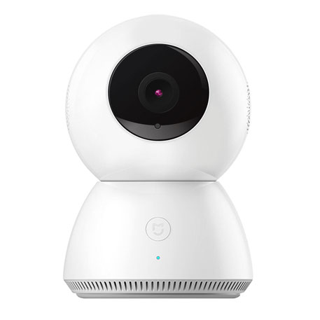

---
- WARNING - DISCLAIMER -
===
**Many files on the Mijia 360 are writable. Be very careful when you modify files on it, you might brick it forever.**

----

xiaomi-hack project
===================

Special thanks go to **fritz-smh** : https://github.com/fritz-smh/yi-hack

This xiaomi-hack project has been totally inspired from its own project.

Purpose
=======

This project is a collection of scripts and binary files to hack various Xiaomi cameras :

* Mijia 360



* *to be completed soon...*

These cameras have the following default features :

* wifi setup from a smartphone application
* video data sent over the network on Chinese servers in the cloud to allow people to view camera data from their smartphone wherever they are
* local video storage on a SD card


This hack intends to provide following features :

* Telnet server
* FTP server
* RTSP server

Installation on the camera
==========================

The memory card must stay in the camera ! If you remove it, the camera will start without using the hack.

Prepare the memory card
-----------------------

Clone this repository on a computer :

    git clone http://github.com/niclet/xiaomi-hack.git
    
Then, format a micro SD card in fat32 (vfat) format and copy the content of the **xiaomi-hack/sd/** folder at the root of your memory card.

Start the camera
----------------

* If plugged, unplug the camera
* Insert the memory card in the camera
* Plug the camera
* Follow instructions to pair with your mobile app. This is only needed the first time.

The camera will start. The led will indicate the current status :

* yellow : camera startup
* blue blinking : network configuration in progress (connect to wifi, set up the IP address)
* blue : network configuration is OK. Camera is ready to use.

Use the camera
==============

Telnet server
-------------

The telnet server runs on port 23.

Default password for **root** user is **imi_ipc**

FTP server
----------

The FTP server runs on port 21.

No authentication is needed, you can use anonymous user.

RTSP server
-----------

The RTSP server is not yet available.


BETA !
======

For now, it is just a proof of concept. Many work has still to be done.


How it works ?
==============

Hack content
------------

````
ext-pro.sh			           Mijia 360 camera backdoor
xiaomi_hack/                   Hacks folder
  logs/                        Logs folder, you'll find various logs there
  mijia360/                    Mijia 360 hack
    bin/
      tcpsvd                   TCP Service Daemon (http://smarden.org/ipsvd/index.html) to launch FTP Server Daemon (ftpd)
    config.cfg                 Configuration file
    sh/
      miio_post.sh             This script is run after official miio.sh
      miio_pre.sh              This script is run before official miio.sh
    shadow.backup              Backup of original /etc/shadow, don't modify it in anyway !
````

Hack customization
------------------

Each camera hack can be customized from its **config.cfg** file.

